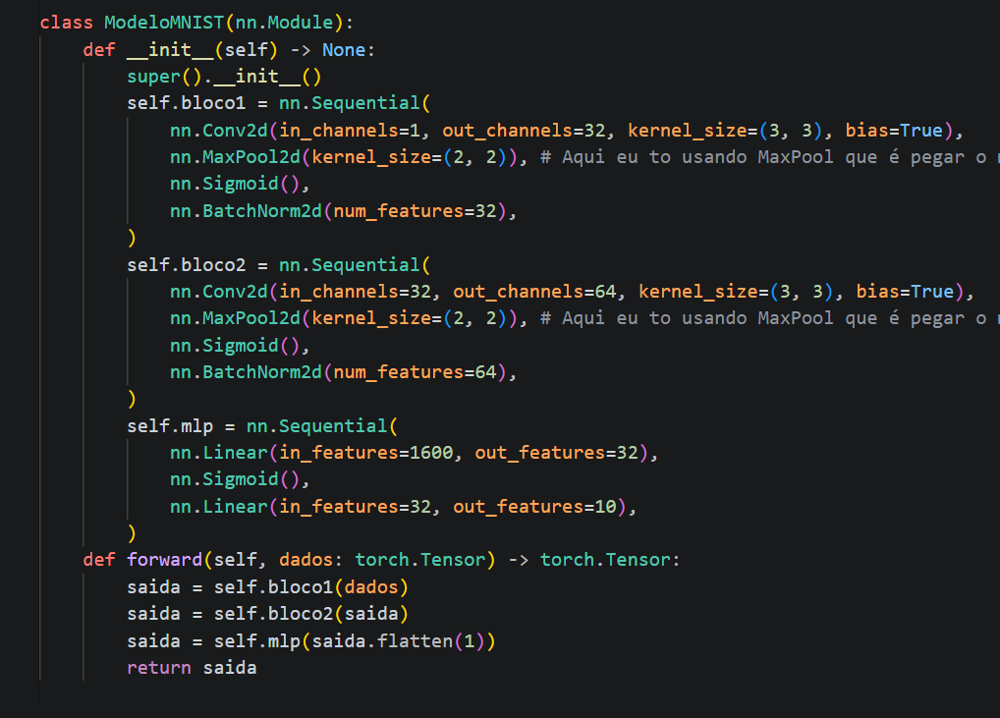
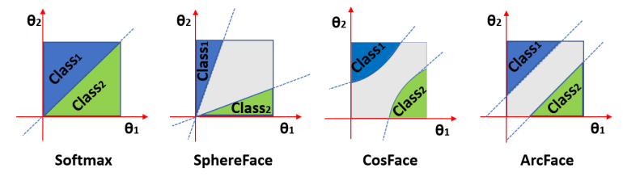
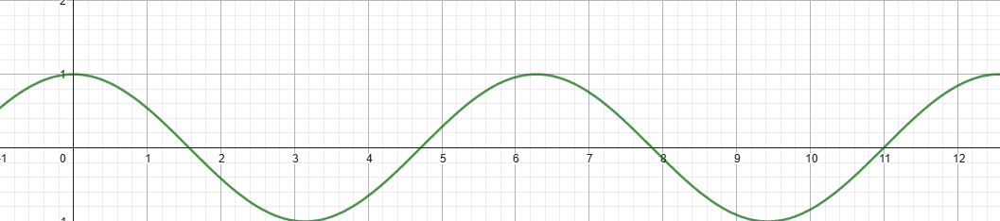
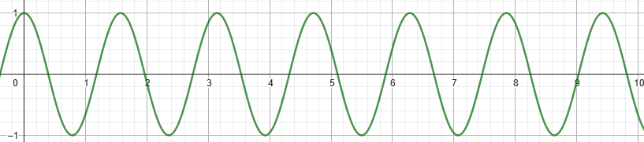

# Objetivo
Receberei uma imagem já segmentada, depois meu modelo vai separar o rosto em landmarks(pontos em áreas importantes) nos olhos, boca e nariz. Passando essas informações para o modelo em si reconhecer.

Pipeline:
PEGA ROSTO RECORTADO
RECONHECIMENTO FACIAL (ArcFace)
COSINE SIMILARITY(Não da pra fazer comparação por distância euclidiana pois estamos em uma hiperesfera)

# ArcFace
[Artigo do ArcFace que eu extrai tudo que vou dizer aqui](https://arxiv.org/pdf/1801.07698)
No geral ArcFace resolve problemas de classificação e generalização, no sentido de separa os embeddings de cada pessoa perto das mesmas pessoas no espaço vetorial e longe se elas forem pessoas diferentes.

Eles usam o termo backbone para falar sobre uma área que eu fiz assim no MNIST  A tradução liteal é espinha dorsal, eu posso usar como Rede base.

Eles propoem uma loss function chamada de "ArcFace" :D
Ele usa o "Additive Angular Margin Loss" para reduzir as distâncias inta e inter classes já mencionada anteriormente.

Funções que eles eles passam no quesito sucesso é a SoftMax Loss que é descrita no mesmo artigo como $$
L_1 = -\log  \frac{e^{W_{y_i}^T x_i + b_{y_i}}}{\sum_{j=1}^{N} e^{W_j^T x_i + b_j}} 
$$

Olhando essa função é possível perceber que ela é feita a partir da SoftMax function e da Entropia Cruzada. Ela é boa em fazer o reconhecimento porém na "deep face recognition" ela perfoma mal em classifica variações de aparência como idade e poses diferentes pois as classes são formadas pertos uma das outras pois ele não força a separação dessas classes. Ela funciona a partir da normalização em um vetor de probabilidades e depois do cálculo atráves do que é e do esperado.

O artigo cita o Triplet Loss também. Nele você coloca três imagens, uma âncora ou numa tradução melhor, pivô. Uma dessa mesma pessoa e outra de aluém diferente dessa imagem. A função funciona e separa bem as pessoas resolvendo o problema da SoftMax Loss, porém ele tem um custo elevado exponencial em datasets grandes, o que acaba não sendo viável em bancos de dados como LFW. 
$$
\text{Loss} = \sum_{i=1}^{N} \left[ \| f_i^a - f_i^p \|_2^2 - \| f_i^a - f_i^n \|_2^2 + \alpha \right]_+
$$
Sendo "a" a âncora, "p" a positiva e "n" a negativa. 

O artigo cita ainda a SphereFace Loss e a CosFace Loss e foram justamente dessas funções que ele se inspirou pois ele resgata a "angular margin" e a "arc-cosine" usadas nelas porém sem uma notável instabilidade da SphereFace por exemplo.. 

$$
L = -\log \left(
\frac{e^{s \cdot \cos(\theta_{y_i} + m)}}
{e^{s \cdot \cos(\theta_{y_i} + m)} + \sum_{j \ne y_i} e^{s \cdot \cos(\theta_j)}}
\right)
$$

Como uma ela é modificação direta da SoftMax Loss,  ela também mede o erro(cross-entropy) e transforma os resultados em probabilidades(SoftMax), porém agora incorporando elementos da SphereFace e da CosFace, dessa maneira trabalhando também com ângulos como a SphereFace trabalha com uma hiperesfera. 

Separando o que ocorre numa linha do tempo, ele gera de inicio uma normalização dos vetores e o resultado é passado com ângulos. A partir desse resultado são feitos os scores e depois uma margem, forçando uma separação ainda maior entre a classe certa e da classe errada. Logo após ele passa por uma mudança de escala(o parâmetro "s" é um fator de escala que aumenta a separação entre as probabilidades no softmax, evitando gradientes muito pequenos e melhorando a convergência do modelo.), passando pelo softmax no final para achar uma probabilidade e assim ao final obtendo o loss pelo "-L = -log(p_y)" restante. 

Na fórmula o $\cos(\theta)$ mede a similaridade (o nome dessa técnica de separação é cosine similarity) , o "m" força uma separação maior, o "s" melhora o treino com escala, o "$e^{s...}$" transforma em probabilidade e o "log" penaliza o erro. 

Fronteira de decisão : "Decision margins of different loss functions under binary classification case"

Elucidando um pouco do que está acontecendo na imagem

É um gráfico de coordenadas angulares, então é uma projeção angular.
Esse modelo decide "esse vetor pertence a qual classe?"
Partindo do principio que todas aí usam o modelo de $$
W^T x = \|W\| \, \|x\| \cos(\theta)
$$

## Softmax 
Essa separação de classes que o vetor se instala não são bem separadas pois há uma junção muito forte das classes. Isso acontece pela forma que a Softmax funciona, pelo produto escalar normal $W^tx$

Separação fica muito fraca.

### SphereFace 
Ela é a multiplicative angular margin
representada pelo $cos(m\theta)$. Isso multiplica o angulo por um número, aumentando a separação angular e dando esse aspecto da imagem.

Ela é mal vista pela função não ser monotônica(quando uma função só cresce ou só diminui) e ser instável.

A ideia é que se a gente multiplica o cosseno, a gente acelera essa função e assim força ela a ser mais rapida por aumentar a oscilação do cosseno e dessa forma mexe com o score do modelo. Isso gera ambiguidades na otimização e torna o treinamento instável, dificultando a convergência do modelo.
##### Usando $cos(x)$

##### Usando $cos(4x)$

\[
L = -\frac{1}{N} \sum_{i=1}^{N} \log \left( 
\frac{e^{\|\mathbf{x}_i\|\psi(\theta_{y_i,i})}} 
{e^{\|\mathbf{x}_i\|\psi(\theta_{y_i,i})} + \sum_{j \ne y_i} e^{\|\mathbf{x}_i\|\cos(\theta_{j,i})}} 
\right)
\]
Analisando cada termo:
\( \mathbf{x}_i \) = Embedding da amostra $i$.

\( \|\mathbf{x}_i\| \) = Norma do embedding. Atua como escala.

\( \theta_{y_i,i} \) = Ângulo entre o embedding \(x_i\) e o peso da classe correta

\( \theta_{j,i} \) = Ângulo entre o embedding e os pesos das classes incorretas.

\( \psi(\theta) \) = Função que substitui \( \cos(\theta) \) e introduz margem angular multiplicativa. Essa função é um pouco grande então eu abstrai também para o símbolo acima mas ela representa essa ao lado -> $\psi(\theta)= (-1)^kcos(m\theta)-2k$. 

\( k \) = Garante continuidade da função por partes. Ele é aprendido durante o funcionamento da função dinâmicamente atráves da formula $k = [\frac{m\theta}{\pi}]$. Ele é um pouco confuso de entender mas ele dita em qual parte da função esse ângulo está. Então por exemplo, se meu $m = 2$ e $\theta = 90$, a conta ficaria $k=\frac{2*90}{\pi}=>0$. Sendo o resultado para todo ângulo acima de 90 para 1 e para baixo 0. 

\( m \) = Hiperparâmetro principal = Controla a margem angular.

### Experimentos com ângulos fixos:

#### Configuração:

- \( \theta_y = 30^\circ \)
- \( \theta_j = 60^\circ \)
- \( \|\mathbf{x}\| = 1 \)

SphereFace com $m = 2$

\[
\cos(2 \cdot 30^\circ) = \cos(60^\circ) = 0.5
\]

\[
P_y \approx 0.50
\]

Sendo o k = 1 se ele está na metade do intervalo e k = 0 se ele está na outra metade. Intervalo esse estipulado entre 0 e $\pi$.

• \( k = 0 \) -> \(\theta \in [0, \frac{\pi}{2}]\)  
• \( k = 1 \) -> \(\theta \in [\frac{\pi}{2}, \pi]\)

SphereFace com $m = 4$

\[
\cos(120^\circ) = -0.5
\]

\[
P_y = \frac{e^{-0.5}}{e^{-0.5} + e^{0.5}} \approx 0.27
\]

Sendo k agora separado em 4 intervalos:
• \( k = 0 \): \(\theta \in [0, \frac{\pi}{4}]\)  
• \( k = 1 \): \(\theta \in [\frac{\pi}{4}, \frac{\pi}{2}]\)  
• \( k = 2 \): \(\theta \in [\frac{\pi}{2}, \frac{3\pi}{4}]\)  
• \( k = 3 \): \(\theta \in [\frac{3\pi}{4}, \pi]\)

| m | Logit correto | Probabilidade |
|--|--|--|
| 1 | 0.866 | 0.59 |
| 2 | 0.5   | 0.50 |
| 4 | -0.5  | 0.27 |

Conclusão: Mesmo ângulo, mas classificação fica mais difícil conforme $m$ aumenta pela probabilidade menor quando ele se afasta do centro, no geral o que está acima diminui e o que está abaixo da média também. Um adendo é que, quando eu cito probabilidade, é o resultado do que está dentro do $log$ na fórmula central. 
Qual o motivo de eu ter experimentado usando apenas o $m$? Ele é o único elemento que muda todo o resultado, o K po exemplo é calculado usando ele, os ângulos são obtidos a partir do resultado do modelo junto do embedding então apenas o 

Obs: 
$m \to 1$ = Equivalente à softmax comum, sem margem angular
$m \to \infty$  = \( \cos(m\theta) \) oscila rapidamente

\( \|\mathbf{x}\| \to 0 \) = Distribuição uniforme de probabilidades e o modelo perde poder de decisão e por conseguinte separação
\[
P_y \approx \frac{1}{\text{a}}
\]

### CosFace 
A formula que o cosseno fica ao final da normalização é $cos(\theta)-m$
Gerando forçadamento uma separação maior entre as classes pois mexe no valor do cosseno e não necessariamente no Theta. Deixando ele menos geométrico. 

\[
L = -\frac{1}{N} \sum_{i=1}^{N} \log \left(
\frac{e^{s(\cos(\theta_{y_i}) - m)}}
{e^{s(\cos(\theta_{y_i}) - m)} + \sum_{j \ne y_i} e^{s\cos(\theta_j)}}
\right)
\]

\(\mathbf{x}_i\) = embedding da amostra \(i\)  

\(\|\mathbf{x}_i\|\) = norma (normalmente normalizado para 1)  

\(\theta_{y_i}\) = ângulo entre embedding e peso da classe correta  

\(\theta_j\) = ângulo com classes incorretas  

\(\cos(\theta)\) = similaridade angular  

\(\mathbf{W}_j\) = vetor de peso da classe  

\(m\) = margem aditiva (hiperparâmetro)  

\(s\) = fator de escala (hiperparâmetro)  

#### Testes com ângulos fixos

- \( \theta_y = 30^\circ \)
- \( \theta_j = 60^\circ \)
- \( s = 1 \)

#### Caso base (sem margem)

\[
\cos(30^\circ) = 0.866
\]

\[
\cos(60^\circ) = 0.5
\]

\[
P_y \approx 0.59
\]

#### \( m = 0.2 \)

\[
0.866 - 0.2 = 0.666
\]

\[
P_y = \frac{e^{0.666}}{e^{0.666} + e^{0.5}} \approx 0.54
\]

#### \( m = 0.5 \)

\[
0.866 - 0.5 = 0.366
\]

\[
P_y \approx 0.47
\]

#### \( m = 0.8 \)

\[
0.866 - 0.8 = 0.066
\]

\[
P_y \approx 0.39
\]

| m |probabilidade |
|--|--|
| 0   | 0.59 |
| 0.2 | 0.54 |
| 0.5 | 0.47 |
| 0.8 | 0.39 |

Então ao aumentar o $m$ ele força o modelo a reduzir o ângulo. Sendo m=1 um número absurdo para o hiperparâmetro.

#### Testando diferentes valores de \( s \)
Classe correta:
\[
\cos(\theta_y) - m = 0.866 - 0.5 = 0.366
\]

Classe incorreta:
\[
\cos(\theta_j) = 0.5
\]

### \( s = 1 \)

\[
e^{0.366} \approx 1.442
\]
\[
e^{0.5} \approx 1.649
\]

\[
P_y \approx 0.467
\]

### \( s = 5 \)

\[
e^{1.83} \approx 6.23
\]
\[
e^{2.5} \approx 12.18
\]

\[
P_y \approx 0.338
\]

### \( s = 10 \)

\[
e^{3.66} \approx 38.9
\]
\[
e^{5} \approx 148.4
\]

\[
P_y \approx 0.207
\]

### \( s = 30 \)

\[
e^{10.98} \approx 5.9 \times 10^4
\]
\[
e^{15} \approx 3.27 \times 10^6
\]

\[
P_y \approx 0.018
\]

| s | probabilidade |
|--|--|
| 1   | 0.467 |
| 5   | 0.338 |
| 10  | 0.207 |
| 30  | 0.018 |

O "s" e o "m" parecem funcionar da mesma forma, e no final eles dão uma mudança parecida no resultado final, porém de formas diferentes. 
- m -> altera a posição relativa da classe correta e por consequência define o quão difícil é acertar.
- s -> altera a intensidade da decisão da softmax e em síntese define o quão sensível é a decisão.

### ArcFace 
A fórmula após a normalização fica dessa forma $cos(\theta + m)$ Então ao expandir essa relação temos $cos(\theta)cos(m)-sen(\theta)sen(m)$ introduzindo a não linearidade suave e atuando no $ "\theta"$ enquanto respeita a monotocidade.
#### Olhando separadamente cada termo da formula do ArcFace:
$$
L = -\log \left(
\frac{e^{s \cdot \cos(\theta_{y} + m)}}
{e^{s \cdot \cos(\theta_{y} + m)} + e^{s \cdot \cos(\theta_{j})}}
\right)
$$
Supondo valores comuns para uma operação de loss, assim que ocorreria ela.
- \( \theta_y = 30^\circ \)
- \( \theta_j = 60^\circ \)
- \( m = 0.5 \) rad (~28°)
- \( s = 30 \)

- \( \cos(30^\circ + 28^\circ) \approx \cos(58^\circ) \approx 0.53 \)
- \( \cos(60^\circ) \approx 0.5 \)

- Numerador: \( e^{30 \cdot 0.53} = e^{15} \)
- Denominador: \( e^{15} + e^{15} \)

Probabilidade ≈ 0.71  

$$ L \approx -\log(0.71) \approx 0.34 $$
##### Agora supondo um numero absurdo para o M:

- \( m = 1.0 \) rad (~57°)

- \( \cos(30^\circ + 57^\circ) = \cos(87^\circ) \approx 0.05 \)

- Numerador: \( e^{30 \cdot 0.05} = e^{1.5} \)
- Denominador: \( e^{1.5} + e^{15} \)

Probabilidade ≈ 0  

$$L = \text{muito grande} \rightarrow 13,5 $$
Dessa forma, se a $m$ ou margem for maior = diretamente penalização maior. 

##### Supondo um número mais alto para S:

- \( s = 64 \)

- \( e^{64 \cdot 0.53} = e^{33.9} \)
- \( e^{64 \cdot 0.5} = e^{32} \)

Probabilidade ≈ 0.87  

$$
L \approx -\log(0.87) \approx 0.14
$$
  
O fator de escala s aumenta a separação entre classes no softmax, ele não está diretamente relacionado à quantidade de amostras ou ao tamanho do espaço amostral. Inicialmente eu pensei que ele mudaria de acordo com o númeo de amostras e do espaço que elas se organizariam no modelo angular mas eu estava errado. Em vez disso, s controla a intensidade dos logits, tornando a classificação mais ou menos sensível às diferenças angulares entre embeddings.

##### Estrapolando muito o S

- \( e^{200 \cdot 0.53} = e^{106} \)
- \( e^{200 \cdot 0.5} = e^{100} \)

 Valores absurdamente grandes diminuindo o Loss ou aumentando ele de formas absurdas.
 Usando a nossa formula base o resultado seria
 $$L \approx 0.0025$$ 

| Parâmetro | Efeito na Loss |
|----------|---------------|
| \( m \uparrow \) | Loss aumenta |
| \( s \uparrow \) | Loss diminui (até certo ponto) |
| \( \theta_y \uparrow \) | Loss aumenta |
| \( \theta_j \downarrow \) | Loss aumenta |
 

### Pipeline melhor explicada:
Imagem (rosto recortado 112×112)  
Entrada do sistema já contendo apenas o rosto
↓  
Alinhamento  
Etapa opcional que ajusta a posição do rosto (olhos, nariz) para padronizar a entrada e melhorar a consistência.(Perguntar pra Leonardo se a Artur faria isso ou eu faria)
↓  
CNN (Backbone / ResNet50 camadas)  
Rede neural responsável por extrair características importantes do rosto, como padrões de forma e textura.
↓  
Embedding (vetor 512D)  
Representação numérica do rosto. O modelo não reconhece diretamente a imagem, mas compara esses vetores.
↓  
Treinamento (ArcFace)  
O ArcFace atua como função de loss, forçando os embeddings da mesma pessoa a ficarem próximos e de pessoas diferentes a ficarem separados angularmente.
↓  
Comparação (cosine similarity)  
Mede o ângulo entre embeddings. É mais adequada que distância euclidiana, pois os vetores são normalizados.
↓  
Decisão  
Define se duas imagens pertencem à mesma pessoa com base na similaridade entre os embeddings.

## CNN (Backbone)

A CNN (rede neural convolucional), como uma ResNet, é responsável por extrair características relevantes da imagem do rosto.

Ao longo de suas camadas, a rede identifica padrões como contornos, texturas e estruturas faciais, transformando a imagem em representações cada vez mais abstratas.

O uso de arquiteturas como ResNet permite o treinamento de redes mais profundas, melhorando a capacidade de extração de características sem perda de informação.

Existe a ResNet18, ResNet50 e ResNet100. Eu provavelmente utilizarei a ResNet50 pois ela é a mais adequada em termo do piso para poder de processamento e exatidão
## Embeddings

Após a passagem pela CNN (backbone), a imagem do rosto é transformada em um vetor de 512 dimensões, chamado embedding.

Esse vetor representa o rosto em um espaço de alta dimensão. Após a normalização (||x|| = 1), os embeddings passam a estar distribuídos em uma hiperesfera, onde a similaridade entre rostos é medida pelo ângulo entre eles (cosine similarity).

Essa representação torna o modelo mais robusto a variações como iluminação e escala.

## Treinamento

Durante o treinamento, os embeddings gerados pela rede são utilizados pelo ArcFace, que atua como função de loss.

O ArcFace mede a similaridade angular entre os embeddings e aplica uma margem angular, forçando uma maior separação entre classes e organizando os vetores na hiperesfera.

## Decisão

Após o treinamento, na etapa de inferência, o modelo gera embeddings para novas imagens.

A decisão é feita comparando esses embeddings por meio de cosine similarity, determinando se duas imagens pertencem à mesma pessoa com base no grau de similaridade entre seus vetores.

Nessa etapa poderia ser utilizado algo como distância euclidiana mas para seguir o padrão faz mais sentido continuar usando cosine similarity. 
### MediaPipe
Modelo recente(2019) OpenSource da Google que detecta pontos cruciais de um rosto.
ArcFace já faz isso então não tem uso para minha pipeline. Se for útil eu consigo usar depois

Perguntas para a próxima reunião: 
Ele vai reconhecer que é um rosto e depois vai ver um banco de dados para achar quem é a pessoa?

#### videos e livros importantes
[Face recognition](https://www.youtube.com/watch?v=Y0dLgtF4IHM)
[Python Tutorial](https://www.youtube.com/watch?v=sKONgt0CrCk)
Applied Machine Learning and AI for Engineers - Jeff Prosise

[ArcFace Article](https://openaccess.thecvf.com/content_CVPR_2019/papers/Deng_ArcFace_Additive_Angular_Margin_Loss_for_Deep_Face_Recognition_CVPR_2019_paper.pdf)
[SphereFace Article](https://openaccess.thecvf.com/content_cvpr_2017/papers/Liu_SphereFace_Deep_Hypersphere_CVPR_2017_paper.pdf)

Modelo ArcFace com ResNet50 https://github.com/gabmoreira/arcface