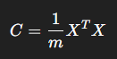
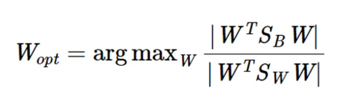

# Introdução
Modelos de aprendizado de máquina alinhados ao reconhecimento facial começaram na década de 60 e se subdividem em 3 gerações. 

Todos os modelos usam a partir do resultado, comparações usando diferenças nas distâncias euclidianas dos vetores.
# Primeira Geração
## Idealizadores
Woodrow W.Bledsoe(Pioneiro na área)
Helen Chan Wolf
Charles Bisson

## Modelo/Técnicas
Método geométrico de regulagem manual

Ele se baseava na medição geométrica de características faciais. Então calculava distâncias e os ângulos desses pontos e então chegava ao resultado se era um rosto ou não.

# Segunda Geração

## EigenFaces/PCA
### Idealizadores 
Matthew Turk
Alex Pentland

### Modelo/Técnicas
A imagem era convertida em vetor e depois feita uma média com eles. Isso significa borrar e usar traços médios de um rosto sem caracteristicas individuais fortes. A partir disso cria-se um vetor com dimensionalidade reduzida porém com alta sensibilidade a iluminação e expressões faciais, uma vez que essas duas criariam falsas caracteristiicas individuais fortes. Então a partir dessas médias é passado o PCA e é encontrado a direção de maior variação das médias e essas direções representam os Eigenfaces.

PCA que é uma operação que pega todos os dados obtidos e percebe quais váriações serão guardadas e quais não serão, reduzindo a dimensionalidade dos dados, redundância e aumentando a acurácia. Todo o cálculo é feito a partir do autovalor e autovetor da matriz de covariância . 
Exemplo: Rosto 200x200 = 20000 pixels totais resultando após o PCA 100 coeficientes.

## Fisherfaces
### Idealizadores
Peter N. Belhumeur
João P. Hespanha
David J. Kriegman
### Modelo/Técnicas
Usa da mesma lógia do modelo anterior, porém, ele aplica um novo método, o LDA e então é criado os Fisherfaces

O erro que o LDA cobre é o erro gerado na variação de ambiente gerando um novo dado, como uma iluminação diferente; ele não extingue esse erro mas ele tenta tratá-lo.

Então após o PCA, multiplas imagens de uma pessoa são testadas para achar se existe uma variação grande no número do PCA, se sim a matriz *Sw* dessa pessoa será grande, se não ela será menor. Mesma coisa ocorre para a matriz *Sb* poorém ele mede a diferença entre pessoas diferentes e calcula o quão grande é a diferença entre elas, se ela or grande o tamannho dessa matriz será grande assim como na outra matriz. Esse método é feito para gerar uma diferença entre pessoas com rostos muito diferentes, separando elas em classes implícitas pelo resultado dessas matrizes nessa função. 
 
$\mathbf {W_{opt}} =  \arg\max _W \frac{|W^TS_BW|}{|W^TS_WW|}$
Esse método preserva as características do rosto na mudança de iluminação porém não resolve o problema das poses.
## Local Binary Patterns
### Idealizadores
Timo Ojala
Matti Pietikäinen
Topi Mäenpää
### Modelo/Técnicas
Ele funciona de forma diferente dos outros dois modelos. A partir de uma máscara ele analisa quadrados ímpares com centros. A partir desses centros ele faz uma operação de limiarização utilizando o centro como parâmetro, sendo acima ou igual ao centro igual a 1 e menor igual a 0. Então esse padrão é lido de forma horária e transcrito em um binário e logo após traduzido para o decimal. Decimal que será utilizado para a textura daquele certo quadrado, dessa forma construindo toda a imagem a partir dessa operação.

Dessa maneira, o LBP é dividido em seções e são criados histogramas baseados na repetição de padrões. Por exemplo, se o número 12 é repetido 10 vezes, ele será contabilizado como 10 e assim em diante. Mantendo assim padrões da mesma pessoa bem parecidos.
# Terceira Geração 
## O que eles tem de parecido?
Normalmente utiliza-se a tecnologia das CNN's. 

De inicio a entrada é a mesma mas o CNN extrai as informações que ele acha conveniente para aquele rosto automaticamente. Logo após isso ele gera um vetor numérico com os resultados. Com esses resultados podemos fazer o cálculo se é a mesma pessoa atráves da distância entre os embeddings, se forem próximos é a mesma pessoa por exemplo. 
Obs: O CNN accontece da mesma maneira como na pasta anterior do MNIST. Ele passa por convolução, função de ativação e poiling. Para então nesse caso ffazer o embedding facial.
## DeepFace( Facebook )
### Idealizadores
Feito pela Meta em 2014
### Modelo/Técnicas
Ele faz o uso da CNN para identificar a região facial e a partir disso ele recria uma parte dessa face num modelo 3d para poder rotacionar à vontade o modelo e finalmente solucionar o problema das diferentes poses.

O que ocorre é o alinhamento desse modelo 3d feito a partir da imagem original para a posição frontal e a partir dela são feitas as operações de classificação ou de decisão(se é a mesma pessoa). Pecando pelo processamento e uso de memória.

## FaceNet ( Google )
### Idealizadores
Feito pela Google em 2015
### Modelo/Técnicas
Usa a rede CNN e logo após faz o embedding facial com um vetor. Porém a partir desse vetor é feito o Triplet loss, em que são definidas 3 imagens sendo elas rotuladas de  Anchor(rosto base), positive(mesma pessoa) e negative(pessoa diferente). A partir disso a rede aprende a aproximar os grupos de positive e afastar grupos de negative. Ao final tendo grupos de pessoas em "locais" mais perto e uma representação geral dos rostos.

### ArcFace
Ela começa aprendendo as caracteristicas gerais como formato dos olhos e constrói o "embedding", após isso ele passa pela normalização desse vetor e após isso o calculo da similaridade angular.

# *detectar faces*
## MTCNN
### Idealizadores
Kaipeng Zhang
### Modelo/Técnicas

MTC vem de multi-task, ele recebe esse nome pois executa 3 ações simultaneamente. Ele detecta a face, refina a posição dela e depois detecta os marcadores faciais.

Na P-net é acionado para encontrar faces na imagem e a partir disso é criada uma área chamada de "Bounding boxes".
Na R-Net ele ajusta as "bounding boxes" ou retira os falsos positivos.
Na O-Net ele detecta as landmarks faciais ou marcadores faciais, tendo no total 3 CNN em uma pipeline.

## Retinaface
### Idealizadores
InsightFace
### Modelo/Técnicas
Essa rede têm seu primeiro passo no "backbone", que é uma CNN profunda. Nele ele extrai bordas e formas para fazer um feature map atráves de arquiteturas como ResNet ( Residual Network, que é uma arquitetura de rede neural utilizada para facilitar o treino de modelos profundos por meio de "skip connections" ). 

Após isso é utilizado o FPN(feature pyramid network), ele detecta a proporção de cada face, por exemplo uma face em uma imagem pode possuir 15 pixels e outra pode possuir 500 pixels, para que a rede não analise todas da mesma forma é feita a construção de camadas profundas para faces com mais pixels e camadas mais rasas para faces com menos pixels.

Após esses passos ele constrói 3 operações, a classificação, a bounding box e os landmarks faciais. Neles são feitas as mesmas operações ditas no MTCNN.

Logo após gerar o resultado de onde está a face com os landmarks dela, ele passa para uma rede como a ArcFace, AdaFace ou o SCRFD(feito pela InsightFace) e gera o resultado.

Possui um framework de código aberto chamado InsightFace.

# Futuros Desafios

## CNN 

Problemas:
Fashion MNIST

### ResNet
Residual network é um conceito para redes MUITO profundas. Esse tipo de conceito é utilziado para manter o aprendizado nessas redes usando um método chamado de Skip Connection (Pesquisar mais sobre)

Problemas:
CIFAR-10 
CIFAR-100 
CelebA (variação)
## ArcFace e ResNet
LFW (faces)

## Posso usar o RetinaFace(Talvez use esse por causa do InsightFace) ou o MTCNN. Pesquisar YOLO também
WIDER FACE (treinar multidões)
SR com dados degradados

## Pipeline final
O que eu preciso? 
Linha do tempo:
DETECTAR ROSTOS. (RetinaFace/InsightFace)
VERIFICAR SE O ROSTO É PEQUENO DEMAIS POR CAUSA DO SR (Usar métrica do tamanho de um rosto detectável)
MELHORAR O ROSTO PEQUENO DEMAIS (Pesquisar modelos para melhorar rosto)
ALINHAR ROSTO PELOS POSSIVEIS ERROS HISTORICOS PREVISTOS ANTERIORMENTE COM ROSTOS "TORTOS"
RECONHECER O ROSTO(FaceNet)

Pesquisar modelos de SR/Melhorar rosto para usar na parte de ver o rosto direitinho. E entender de fato como SR funciona

Se for o plano de trabalho que Leonardo colocou no texto então a pipeline seria:
DETECTAR ROSTO
SEPARAR ROSTO EM EMBEDDNGS (ARCFACE)
FAZER A DISTANCIA EUCLIDIANA E VER SE BATE.

# LIVROS IMPORTANTES UTILIZADOS
Computer Vision: Algorithms and Applications. Richard Szeliski
Deep Learning for Computer Vision. Rajalingappaa Shanmugamani
Face Detection and Recognition: Theory and Practice. Asit Kumar Datta, Madhura Datta e Pradipta Kumar Banerjee (Especificamente para segunda geração)

Hands-On Machine Learning with Scikit-Learn, Keras, and TensorFlow — de Aurélien Géron
Computer Vision: Algorithms and Applications — de Richard Szeliski
Deep Learning — de Ian Goodfellow, Yoshua Bengio e Aaron Courville